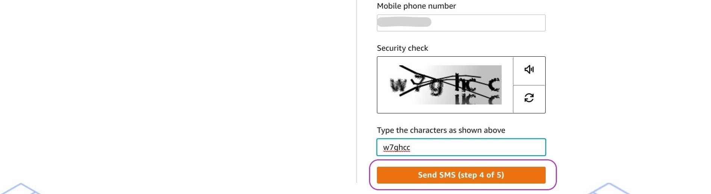
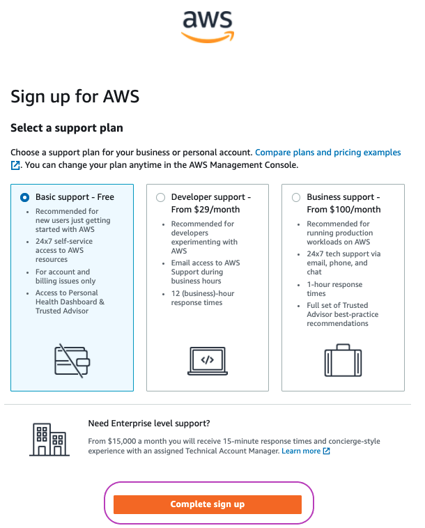
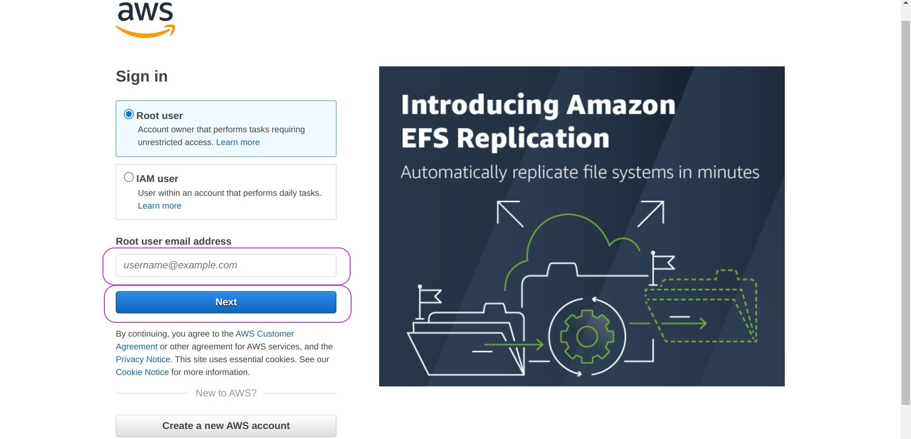
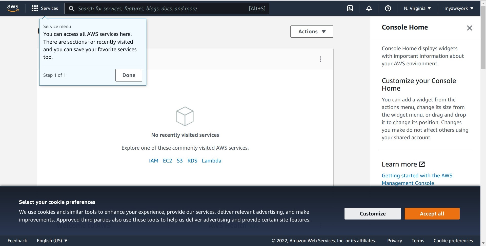

> ## Prerequisites
> You will need the following to complete this episode, your: 
> - email address
> - credit card
> - phone number (associated with credit card)
> - address (associated with the credit card)
{: .prereq}

# Outline
These are the main steps you will follow to open your AWS account:

1. Go to the AWS sign-up page and enter your email (as username) and password.

2. Select your account type (Business or Personal) and enter your contact information.

3. Enter Billing Information: your credit card details.

4. Confirm your identity through a phone call or SMS message.

5. Select support plan (`Basic`) and complete sign-up.

6. Login to your AWS account.

## 1. Go to the AWS sign-up page and enter your email and password

Go to the **sign-up** page by clicking on this link [AWS sign-up](https://portal.aws.amazon.com/billing/signup#/start) --- for convenience, right click on the link and, in the menu that pops up, left click on `Open link in new window`; you can switch between this browser window and the sign-up page window to be opened by pressing the keys Alt-Tab simultaneously. 

The page below will be displayed. Please enter your email and password and a name for your account --- you can change the name of your account later.

> ### Notes:
> 1. new accounts are all granted the one-year Free Tier (message on the left).
> 2. the name of an account helps to identify the account once the user is logged in, as it is not uncommon for AWS users to have more than one AWS account.
{: .callout}

Once you have entered your email, password and account name, **click on** the orange button labelled `Continue (step 1 of 5)` and a `Security check` box like the following will appear just below the box where you entered your account name. Enter the characters displayed to you with no space between them, and then **click on** the orange button again. 

## 2. Select your account type (Personal) and enter your contact information.

The page below will be displayed once you click on the orange button for the second time in the previous step.

Your browser may display the little window on the top right suggesting to save the password you entered in the previous step. Click on the option you prefer. While it is convenient to let the browser save your password so that you don't have to type it often, if you use another machine to login to your account, you will need to type it. 

In the option `How do you plan to use AWS?`, please tick `Personal`; then enter your name, phone number and address, read the *AWS Customer Agreement* and tick the checkbox `I have read and agree to the terms of the AWS Customer Agreement`, and finally click on the orange button labelled `Continue (step 2 of 5`) to move to step 3.

Recall that your address must be the one associated with your credit card as this will be verified in the next step. 

> ### Notes:
> 1. There is no functional difference between a business account and a personal account. Both have access to all AWS services and both support managing sub-accounts which, as we will see in the next episode, are more convenient for every day work. 
> 2. A personal account should not be open with a work email address as you may change jobs after opening the account. A business account should be open with a company or institution address linked to a roll or position and not to a person who may change jobs at some point. 
{: .callout}

## 3. Enter Billing Information: your credit card details.

The page below will be displayed once you click on the orange button in the previous step.

Please enter your credit card details. Note that your credit card will be **verified** once you click on the orange button `Verify and Continue (step 3 of 5)` and that you must select/provide the address associated with your credit card.

Please note the `Secure verification` message on the left: AWS will make, and hold as pending for 3-5 days, a transaction on your card for the equivalent of $ 1 USD dollar to verify it is a valid payment method. The transaction will be reverted and you will not be charged.

As part of the **verification process**, a screen like the one below will pop up. That is, your bank or financial institution will ask you to verify the AWS transaction by sending you a one-time passcode to the phone you have registered with your bank.  Choose the phone for you to receive the passcode, click on the button `Confirm`, and once you receive the passcode enter it as required. 

## 4. Confirm your identity through a phone call or SMS message.

You now need to confirm your identity to AWS through an SMS message or a phone call to the phone number that will be associated with your account (we used the same phone number we entered in step 2). 

Please select SMS message or phone call, enter your phone number and the characters in the security check box, and finally click on the orange button `Send SMS (step 4 of 5)`. Once you receive the SMS message with the code, enter the code as required. After you enter the code, another page will be displayed for your to select a support plan. 

You will receive the SMS or a phone call within a few seconds.

## 5. Select support plan (`Basic`) and complete sign-up.

You must now select a support plan. Select the `Basic support` plan and click on the orange button `Complete sign-up`.  The Basic support plan is free and you don't need more than this if this is your first AWS account, as you first need to experiment with it.

The congratulations page below will be displayed (once your click on the orange button `Complete sign-up` above), telling you that your account is being activated and will be ready in a few minutes. 

You will also receive three emails from AWS to the email address you used to sign up with these subjects: 

- "Welcome to Amazon Web Services"
- "AWS Support (Basic) Sign-Up Confirmation"
- "Your AWS Account is Ready - Get Started Now"

These emails have links to useful information and resources.

## 6. Login to your AWS account.

In the congratulations page (of the previous step), please click on the orange button `Go to the AWS Management Console`. This will display the login page below for you to login to your account. 

> ### Notes:
> 1. The login page will give you the option to login either as the `Root user` or as an `IAM user` --- IAM stands for Identity Access Managment. 
> 2. You can read in the page that the `Root user` account is for the owner of the account who "performs tasks requiring unrestricted access", such as updating billing information or deleting the account, while an `IAM user` account is for a user who "performs daily tasks" such as using AWS services. 
> 3. Obviously, at this stage you can only login to the `Root user` account. In the next episode you will create an IAM account which you will use to create and manage your instance.
{: .callout}

Please login to your `Root user` account by entering the email address that you used to open your account in step 1. 

Once you press the `Enter` key or click on the blue `Next` button, you will be prompted (see the three screens below) to (1) enter some characters by a "Security check" box and then your password  (please do as required), (2) select either the previous or the new version of the `Console Home` (please choose the new version), and (3) select your cookie preferences (select as you prefer). 

Finally you will be logged in as `Root user`, able to use your account. We will first configure your account in the next episode.

> ## Please make a note
> As you eventually will logout from your account, please make a note of the address to log back in to the AWS Managment Console: 
> `aws.amazon.com/console` or `https://aws.amazon.com/console`
{: .callout}

