> ## Prerequisites
> To complete this episode you will need:
> - to have opened your AWS account as described in the first episode of this lesson: [Create Your AWS Account](../01-create-your-account). 
> - to be logged in to your AWS account as a **Root User** described also in that episode (at the end). 
> - ideally, your mobile phone to add MFA authentication to your AWS account. However, **if you don't have a mobile phone, you can skip this step** and still use your AWS account.
{: .prereq}

# Introduction
> ## Steps
> These are the main steps you will follow to configure your AWS account:
>
> 1. **Change the default region of your account to Ireland**\
> AWS services are provided through many regions around the world and a region is allocated by default. You will need to change the region of your account to Ireland because the Amazon Machine Image from which you will create your AWS instance is stored in the Ireland region. But you can later change your account region if you wish.  
>
> 2. **Secure your AWS account**\
> The account your created in the last episode is your Root user account and can perform any operation including closing the account. It is best practice to use the Root user account only for high-level administration and to create and an IAM user account for day-to-day work. It is also best practice to secure the Root user account with multi-factor authentication (MFA).
>
> 3. **Create an IAM user account to create and manage your instance**\
> IAM user accounts are attached to a **User Group** that has a set of specific permissions (such as reading, writing and deleting) on specified resources. We will create a User Group with predefined permissions and a IAM user account in that group. 
>
> 4. **Create and alias for your account id**.\
> Your Root user account id is a 12-digit number that is difficult to remember. We are going to create an alias that is easier to remember. This is especially useful because the alias will replace the 12-digit number in the web address for logging in to your account. 
{: .callout}

## 1. Change the default region of your account to Ireland

Once you have logged to your AWS Root user account, your browser will display a page showing the default region in the top right. This may be **N. Virginia** or another default.
You need to change the region to **Europe (Ireland)  eu-west-1** using the drop-down menu. Your browser will redirect to the AWS servers in the selected region.

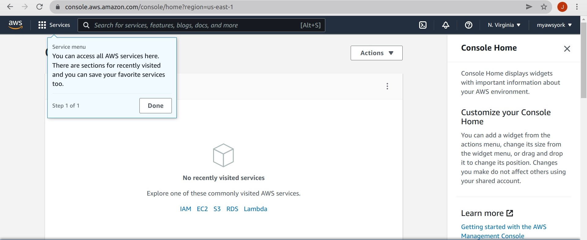

> ## Note
> You can change the region any time you need. 
{: .callout}

## 2. Secure your AWS **Root user** account

We now are going to add multi-factor authentication (MFA) to your Root user account as an extra security mechanism. This requires you to download an app to your mobile phone, as described below. 

> ## No mobile phone?
> If you don't have a mobile phone, don't worry, you can skip this step and go straight to **3. Create an IAM user account to create and manage your instance**.  
> If you are not using MFA it is best to use your AWS Root user account only from your personal computer or trusted computer.
{: .callout}

Type **iam** in the AWS search box and press Enter. You will be presented with the "IAM Dashboard". Click on **Add MFA**.

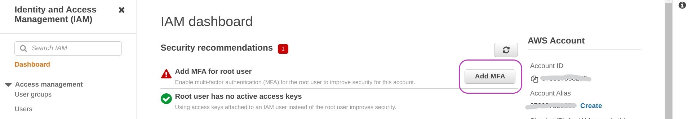

On the page that appears, "Your Security Credentials", click **Activate MFA**.

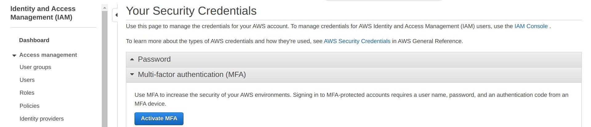

A pop-up window called "Manage MFA device" will appear. Select **Virtual MFA device** and **Continue**.

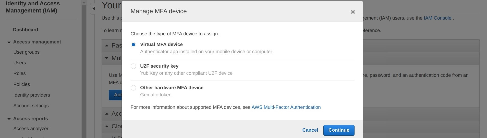

You will now be presented with a pop-up called "Set up a virtual MFA device". Don't select anything at the moment.

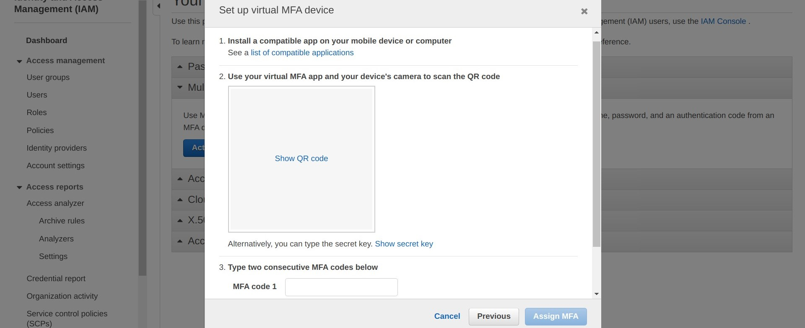

To set up your mobile as MFA device you will need a Virtual MFA app on your mobile phone. We have tested Duo Mobile and Google Authenticator and give instructions for both but you may already be using another app. AWS lists some options: [AWS MFAs](https://aws.amazon.com/iam/features/mfa/).

**If you do not have a Virtual MFA app on your mobile phone:**
Go to the app store on your phone, search for Duo Mobile *or* Google Authenticator, and install it.

Once you have installed an MFA app in your mobile:
- Return to the "Set up a virtual MFA device" pop-up on your computer and choose **Show QR code**.
- Open the MFA app on your phone
  - Press **+ Add** in Duo Mobile or **+** in Google Authenticator 
  - Press **Use QR code** in Duo Mobile or **Scan a QR code** in Google Authenticator. Your camera will open to scan a QR code.
  - Point your camera at your computer screen showing the QR code to scan. You may need to adjust the zoom for the scan to occur.
- Once the scan is successful, the MFA will display a number for about 30 seconds, and then another number for the same time, and so on until you close it. 
- Of those numbers shown in your mobile MFA, you need to enter two consecutive numbers into the fields **MFA Code 1** and **MFA Code 2** on the "Set up a virtual MFA device" pop-up on your computer. You may need to scroll down to see MFA Code 2. **NB: enter the numbers with no space between them** even if they are shown with a space in your mobile.
- Click on **Assign MFA**. 

You will see a success message which you can close.

Every time you login to your Root user account, you will be asked to enter your password and an MFA code number you must read from your mobile by opening the MFA app.

## 3. Create an IAM user account to create and manage your instance

We are going to create an IAM user account with which you will create and manage your AWS instance in the next lesson. This means first creating an IAM User Groups with one or more security policies, and then IAM user accounts within that User Group.

We will create a user group called **Administrators**, then a user account called **YourName** (your actual name), and finally attach the account to the group. As this is the first IAM group and account to be created, we need to do this with the Root user account, but then it will be possible to do it with the IAM account we will create because it will have Administrator privileges.

#### **Create the user group**

Go to the IAM Dashboard page by typing **iam** in the AWS search box and pressing Enter. One the IAM Dashboard, click on "User groups" under "Access Management" on the left. Then **Create group**

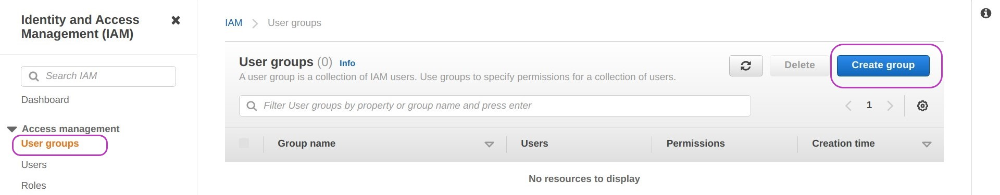

The "Create user group" page will appear. Type "Administrators" in the "User group name" box but **don't press** Enter.  Scroll down until you see the section "Attach permissions policy - *Optional*". This section has a search box and a list of different policies.

Then type "administratoraccess" in the search box and press Enter.

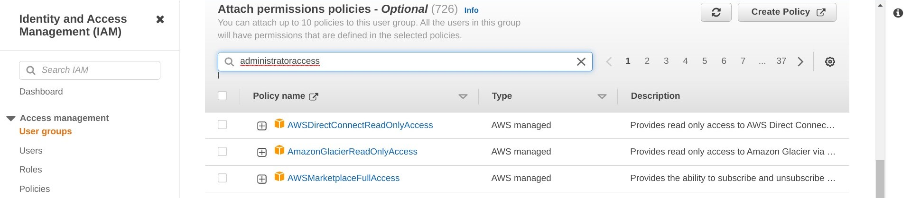

This will bring the "AdministratorAccess" policy to the top of the list. Check the box next to that policy and **Create group**. The screen displayed after creating the group may indicate it is loading users --- it's OK, ignore it.

You now have a user group called **Administrators**

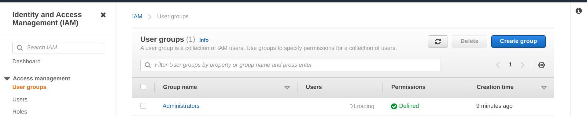

#### **Create the user and add it to the group**

The next step is to create your IAM user account. Under "Access Management" on the left, click on "Users".

The page titled "Users" will be displayed. Click on **Add users**. 
You can now set user details by:
- typing your user name (a single word) 
- checking the "Password - AWS Management Console access" box
- then checking "Autogenerated password" and "User must create a new password at next sign-in" as checked.

Then **Next: Permissions**

 typed into the User name box and the 'Password - AWS Management Console access' box checked")
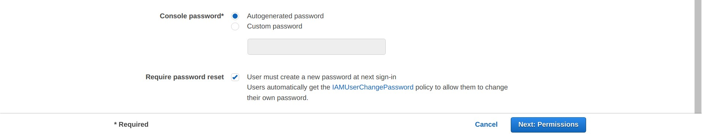

You will be presented with a page that says "Add user - Set permissions". The **Add user to group** option should be set. Leave it set. Check the box next to the group Administrators and then **Next: Tags**

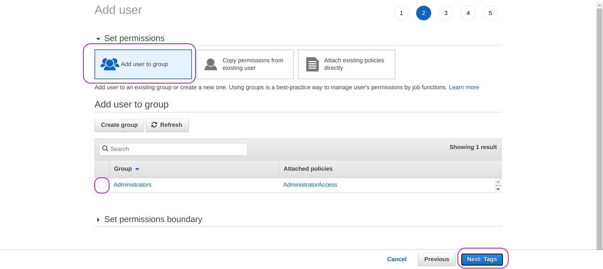

Adding a tag - or keyword - for a user is optional. You don't need to tag your user account for the time being. It is useful when you are managing multiple user accounts.
Click **Next: Review**. This will display the options chosen for the user account for review. If these are correct click **Create user**

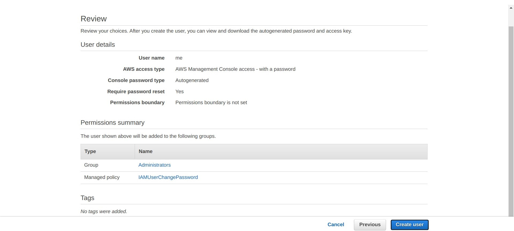

In the page that appears "Add user - Success" (below), there is some information that your will need later when you login to your IAM account as described shortly, please:

- click on the gray button `Download .csv` on the left to download the file which contains your account login details. 
- take note of the web address (url) in blue: https://123456789012.signin.aws.amazon.com/console  --- the 12-digit number will be your actual account id.
 
See comments and instructions after the page.

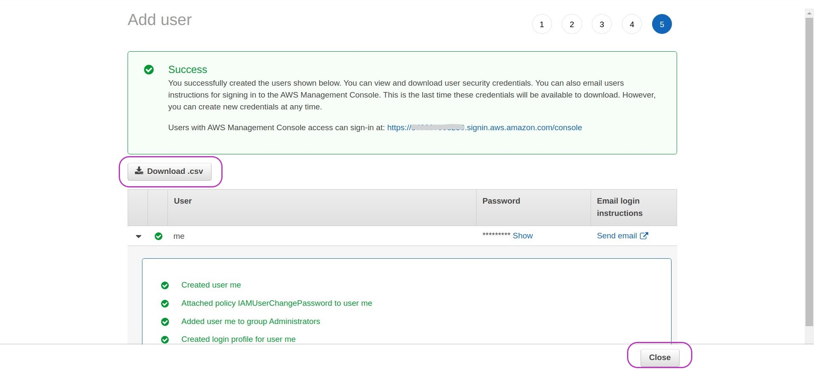

The file you downloaded is a *comma separated value* (CSV) file that contains your username, your randomly generated password, and the web address where you will login to as IAM user; its content is something like this:
                             
`me,0ji)8[bN3{F-X!h,,,https://123456789012.signin.aws.amazon.com/console`

In this line, the first field, `me`, is the user name, the second field (after the first coma), `0ji)8[bN3{F-X!h`, is the password, and the last field (there aren't 3rd and 4th fields), `https://123456789012.signin.aws.amazon.com/console`, is the web address to login.

**NB**: the first time you login you will have to change the password.

Click on the `Close` button and the screen that appears "Users" (below) will show the user you have just created and "Never" under "Last activity" (in the middle of the page), meaning that you have not yet logged in to your account. 

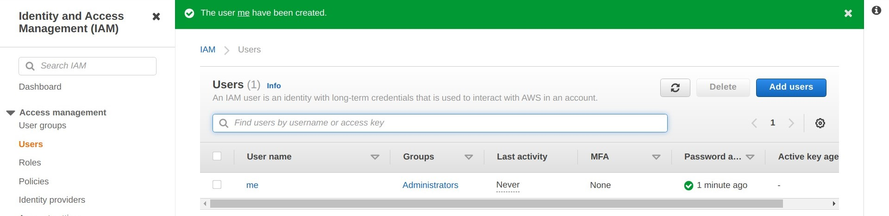

Open a new tab in your browser and go to the login web address of your new account (https://...signin.aws.amazon.com/console). A page like the following one will appear:

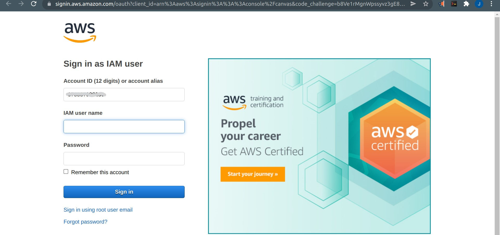

In the page above, the field "account id" is filled because you provided it in the web address. Note that you can provide an alias instead of the 12-digit number. We are going to set up an alias next.

## 4. Create and alias for your IAM user acount

This is the last step to configure your account and is simple and will make it easier for your to login to your account.

Being logged in into your account (either with your `Root user` account or your IAM account), go to the Dashboad page: type `iam` and press `Enter` in the search box within the `aws navigation` bar.

In the page that appears "The Dashboard", on the right side navigation bar, under the heading "AWS Account", is your "Account id" and further below your "Account Alias". Both are the same because you have not set up an alias yet. 

To set it, click on the blue text "Edit" and a screen like the following one will appear:

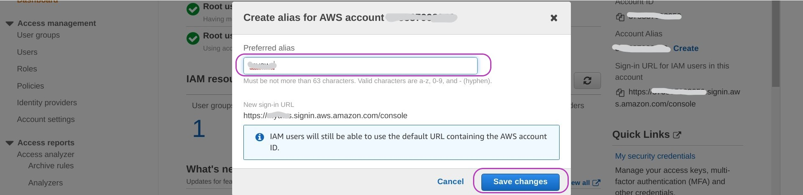

Type the alias you want for your account, say, myawsalias, and click on the blue button `Save changes`. 

You can now login to your account in both web addresses:
https://123yours9012.signin.aws.amazon.com/console   and

https://myawsalias.signin.aws.amazon.com/console

That's all about configuring your AWS account for day-to-day use. Of course, there is much more you can do. But the above is enough for you to create and manage your AWS instance. 

