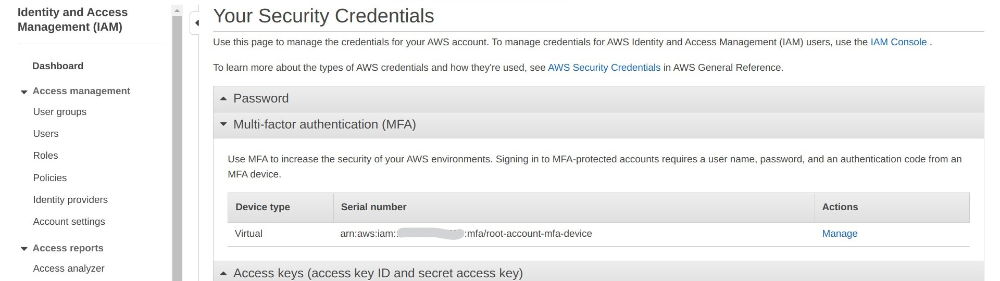
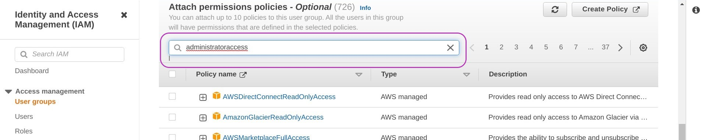
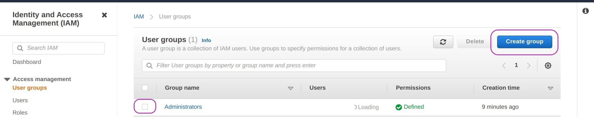
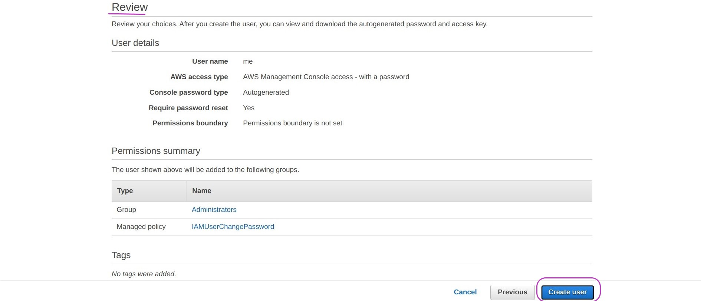

> ## Prerequisites
> To complete this episode:
> - open your AWS account as described in the first episode of this lesson: [Create Your AWS Account](../01-create-your-account). 
> - and login to your AWS account as described also in that episode (at the end). 
>   - click on this link [AWS Management Console](https://aws.amazon.com/console) to login to your account as `Root user` with the email and password you used to open your account. Login in another window so that you can switch between this window and the one to open by pressing the keys Alt-Tab simultaneously.
- You will also need your mobile phone to add MFA authentication to your AWS account, see details below in the Introduction. However, **if you don't have a mobile phone, you can skip this step** and still use your AWS account.
{: .prereq}

# Introduction
> These are the main steps you will follow to configure your AWS account:
>
> 1. **Change the default region of your account to Ireland**\
> AWS services are provided through many regions around the world so that (1) access to services within a region is faster, (2) compliance  . Handling several regions is also the basis to support fault tolerant services: if one region fails, another one can take over the workload. However, handling services over several regions must in general be configured by the user, meaning that, unless you do something to handle multiple-region services, only the services available in the region you are working on will be visible to you. When you open a new AWS account, a region is allocated by default which (we think it) is North Virginia. We need to change the region of your account to Ireland because the Amazon Machine Image from which you will create your AWS instance is stored in the Ireland region. But don't worry, you can change your region any time you need to.  
>
> 2. **Secure your AWS account**\
> The account your created in the last episode is your `Root user` account and has no restrictions. It can perform any operation including closing the account.  It is considered a security best practice (1) to use the `Root user` account only for high-level admin tasks such as changing account settings (account name, email address) and activate Identification and Access Management (IAM) access (outlined in step 3.) among others, see [Tasks that require root user credentials](https://docs.aws.amazon.com/general/latest/gr/root-vs-iam.html#aws_tasks-that-require-root) for more information; (2) to secure the `Root user` account through a multi-factor authentication (MFA) scheme --- we will add MFA based on a mobile phone application; and (3) to create separate IAM user accounts for specific roles and functions as this makes it possible to specify what functions can be carried under a role and who can perform what roles, as outlined next. 
>
> 3. **Create an IAM user account to create and manage your instance**\
> IAM user accounts should be created with specific roles and functions for day-to-day use as this enables tracking responsibility for resource usage. IAM user accounts are created as follows. User Groups are created with one or more security policies, each policy being a set of specific permissions (allowed operations: read, write, delete ..) on speficied resources.  IAM user accounts are then created and attached to a User Group, thus conveying the group permissions to the account user. But don't worry. To create and manage your instance you don't need anything too complex. We  are going to create a user group with a predefined security policy and a user account in that group. 
>
> 4. **Create and alias for your account id**.\
> Your `Root user` account id is a 12-digit number that is difficult to remember for most people. We are going to create an alias that is easy to remember. This is convenient because IAM users login to a web address that includes that account id, for example:  https://123456789012.signin.aws.amazon.com/console. With an alias, say, myaws, the login address will be https://myaws.signin.aws.amazon.com/console wich is easier to remember. Of course the alias must be unique because the account is worlwide accessible. If your alias is already taken, try to use something less common like https://vivamexico.signin.aws.amazon.com/console.
{: .callout}

## 1. Change the default region of your account to Ireland

Once you have logged to your AWS `Root user` account, your browser will display a page/screen like the one below.

In the page below, in the `aws navigation bar` (the long, dark bar just below the gray navigation bar at the top), the default region being shown to the right is `N. Virginia`. The default region of your account may be different and it's OK.

To change your default region to `Ireland`, please click on the region drop-down menu icon, the little white triangle next to `N. Virginia`. A list of AWS regions will pop up. Scroll down the list with the mouse until you find the region `Europe (Ireland)  eu-west-1` and click on it. That's it.

> ### Notes:
> 1. You can change the region any time you need. 
> 2. When you change the region, the address in the `browser navigation bar` will also change as you will be redirected to AWS servers in the selected region. Give it a go: change to a few regions and check the address in the `browser navigation bar`. Remeber to set Ireland as the default region at the end.
{: .callout}

## 2. Secure your AWS `Root user` account

We now are going to add multi-factor authentication (MFA) to your `Root user` account as an extra security mechanism. This mechanism requires to download an app to your mobile phone, as described below. 

**If you don't have a mobile phone** don't worry. Just skip this step and try to use your AWS `Root user` account only from your personal computer or trusted computers. Please go to step 3.

In the search box within the `aws navigation bar`,  please type `iam` and press `Enter`. 

In the page that appears (titled) "IAM Dashboard" (below), click on the gray button labelled `Add MFA`.

In the page that appears "Your Security Credentials", click on the blue button labelled `Activate MFA`.

In the page that appears "Manage MFA device", select "Virtual MFA device" (if not selected already) and click on the blue button `Continue`.

The page below "Set up virtual MFA device" will appear and that means **setting up your mobile as MFA device**. So before proceeding, you need to (1) install in your mobile phone the app that is going to manage MFA authentication, and (2) register your phone-app with AWS by scanning a QR code. Please follow the instructions below the page.

> ### Setting up virtual MFA device 
> - There are various MFA apps you can use in your mobile. We have installed and tried Duo Mobile and Google Authenticator and both work the same way, as described shortly. If you want to use another MFA app, look for Virtual MFA Applications in this page [AWS MFAs](https://aws.amazon.com/iam/features/mfa/) --- hopefully they will work the same; otherwise use any of those two.
> - If you have Duo Mobile or Google Authenticator already installed, go to the next step. Otherwise install one of them in your mobile phone through your Google's Play Store or Apple's App Store app. Once you have installed an  MFA app in your mobile, continue with:
> - In your computer, in the page above, click on the blue text `Show QR code`.
> - In your mobile, run/open your MFA app and once ready:
>   - Press `+ Add` in Duo Mobile or `+` in Google Authenticator 
>   - Then press `Use QR code` in Duo Mobile or `Scan a QR code` in Google Authenticator; both will open your camera to scan a QR code.
>   - Point your mobile phone camera to your computer screen showing the QR code to scan; zoom in/out your mobile so that the QR code in your computer screen gets into the a sort offrame in your mobile screen. 
> - Once the scan is successful, the MFA in your mobile is going to show a number for 30 seconds or so, and then another number for the same time, and so on until you close it. This behaviour is for Duo Mobile and Google Authenticator.
> - Of those numbers shown in your mobile MFA, you need to enter two consecutive numbers into the fields `MFA Code 1` and `MFA Code 2` in the page above in your computer. You may need to **scroll down to see** `MFA Code 2`. **NB: enter the numbers with no space between them** even if they are shown with a space in your mobile.
> - Then  click on the blue button `Assign MFA`. 
{: .callout}

After that you will see this screen:

Once you click on the blue botton `Close`, you will see the page "Your Security Credentials" (below). 

This is the page where you can remove an MFA authentication. This may be necessary if you change your MFA application or mobile phone, etc. --- you will have to delete the old MFA authentication and create a new one. You delete an MFA authentication by clicking on the blue text `Manage` to the right of the MFA authentication you want to remove (see the page below). You will then be given the option to remove it and to confirm the removal.

You get to this page ("Your Security Credentials") as follows:
- In the search box within the (dark) `aws navigation bar`, you will type `iam` and press `Enter` (as you did at the start of this step). 
- The page "IAM Dashboard" will appear, and you will click on the text in blue `My security credentials` which is on the right navigation menu about the middle of the page. You will then see the page "Your Security Credentials".

With MFA authentication, every time you login to your `Root user` account, your will be asked to enter your password, an MFA code number you must read from your mobile by opening the MFA app (then close it), and possibly some characters you must read from a Security check box.  

## 3. Create an IAM user account to create and manage your instance

We are going to create an IAM user account with which you will create and manage your AWS instance in the next lesson. Recall (from the Introduction above) that IAM User Groups are created with one or more security policies, and then IAM user accounts are created and attached to one o more User Groups. 

Thus we are going to create first a user group called **Administrators**, then a user account called **YourName** (your actual name or the name you prefer), and finally attach the account to the group. As this is the first IAM group and account to be created, we need to do this with the `Root user` account, but then it will be possible to do it with the IAM account we will create because it will have Administrator privileges.

#### **Create the user group**

Go to the IAM Dashboard page. In the search box within the (dark) `aws navigation bar`, type `iam` and press `Enter`. 

In the page that appears (titled) “IAM Dashboard” (below), on the left side navigation bar, under Access Management, click on "User groups".

In the page that appears "User Groups", click on the blue button "Create group" on the right: 

In the page that appears "Create user group", in the "User group name" box, enter Administrators  (as shown) but **don't press** `Enter` please. 

Scroll down with the mouse until you see the section "Attach permissions policy - Optional". 

Then type administratoraccess and press `Enter` in the search box as shown below.

After you have pressed `Enter`, the screen content will be updated showing the "AdministratorAccess" policy at the top see page below. 

Please check the box next to that policy as shown below and then click on the blue button `Create group`.

The screen displayed after creating the group (below) may show like it is loading users --- it's OK, ignore it.

#### **Create the user and add it to the group**

To create your IAM user account, in the last page displayed after creating the user group (or go to the IAM Dashboard page as instructed above), in the left side navigation bar (under the heading "Access management"), please click on Users. 

The page titled "Users" will be displayed with a blue button labelled `Add users` on the right. Click on it please.

In the page that appears "Add user - Set user details" (below), enter your user name (a single word) and check the box next to the option "Password - AWS Management Console access" --- **once you check the box** the two last options shown below will pop up in your screen.  

Set the options that popped up as they popped up, namely: "Autogenerated password" and "User must create a new password at next sign-in" as checked.

Then click on the blue button `Next: Permissions`.

In the page that appears "Add user - Set permissions" (below), note that the option at the top, "Set permissions", is set (highlighted in blue) to "Add user to group". Leave it so and check the box next to the group Administrators. Then click on the blue botton `Next: Tags` at the bottom.

In the screen that appears "Add user - Add tags (optional)" (not shown), you can add tags (key-value pairs) to the user account you are creating, which would be rather useful if you were handling many users and you would like to search for them based on their skills in order to assign tasks. For example, you could use the key "programming languages" and then add values like Python, JavaScript, depending on the experience of the user whose account you are creating.

You don't need tags for the time being. Please click on the blue botton `Next: Review` at the bottom and the page below, "Review", will be displayed which summarises the options d chosen for the account to be created.

Click on the blue button `Create user` at the bottom on the right.

In the page that appears "Add user - Success" (below), there is some information that your will need later when you login to your IAM account as described shortly, please:

- click on the gray button `Download .csv` on the left to download the file which contains your account login details. 
- take note of the web address (url) in blue: https://123456789012.signin.aws.amazon.com/console  --- the 12-digit number will be your actual account id.
 
See comments and instructions after the page.

The file you downloaded is a *comma separated value* (CSV) file that contains your username, your randomly generated password, and the web address where you will login to as IAM user; its content is something like this:
                             
`me,0ji)8[bN3{F-X!h,,,https://123456789012.signin.aws.amazon.com/console`

In this line, the first field, `me`, is the user name, the second field (after the first coma), `0ji)8[bN3{F-X!h`, is the password, and the last field (there aren't 3rd and 4th fields), `https://123456789012.signin.aws.amazon.com/console`, is the web address to login.

**NB**: the first time you login you will have to change the password.

Click on the `Close` button and the screen that appears "Users" (below) will show the user you have just created and "Never" under "Last activity" (in the middle of the page), meaning that you have not yet logged in to your account. 

Open a new tab in your browser and go to the login web address of your new account (https://...signin.aws.amazon.com/console). A page like the following one will appear:

In the page above, the field "account id" is filled because you provided it in the web address. Note that you can provide an alias instead of the 12-digit number. We are going to set up an alias next.

## 4. Create and alias for your IAM user acount

This is the last step to configure your account and is simple and will make it easier for your to login to your account.

Being logged in into your account (either with your `Root user` account or your IAM account), go to the Dashboad page: type `iam` and press `Enter` in the search box within the `aws navigation` bar.

In the page that appears "The Dashboard", on the right side navigation bar, under the heading "AWS Account", is your "Account id" and further below your "Account Alias". Both are the same because you have not set up an alias yet. 

To set it, click on the blue text "Edit" and a screen like the following one will appear:

Type the alias you want for your account, say, myawsalias, and click on the blue button `Save changes`. 

You can now login to your account in both web addresses:
https://123yours9012.signin.aws.amazon.com/console   and

https://myawsalias.signin.aws.amazon.com/console

That's all about configuring your AWS account for day-to-day use. Of course, there is much more you can do. But the above is enough for you to create and manage your AWS instance. 

