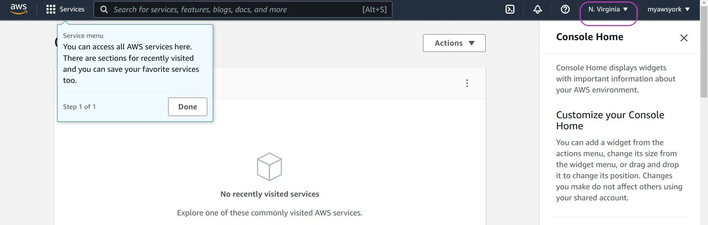
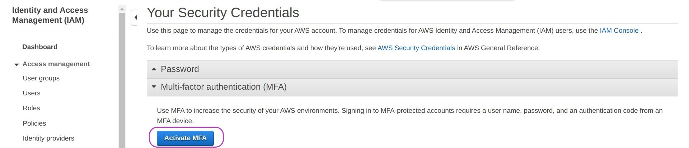
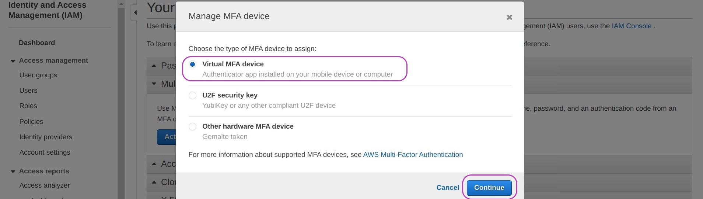
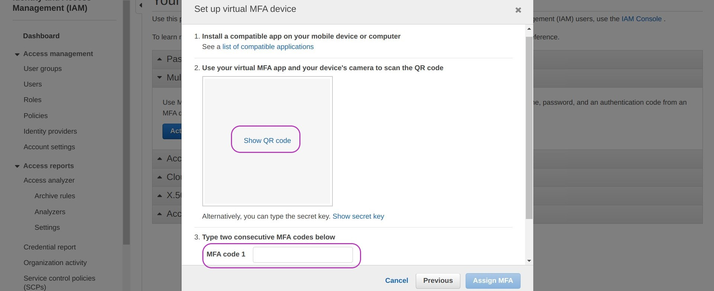
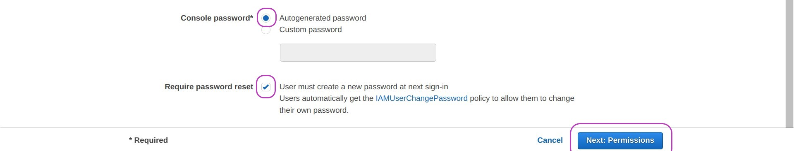

> ## Prerequisites
> To complete this episode you will need:
> - to have opened your AWS account as described in the first episode of this lesson: [Create Your AWS Account](../01-create-your-account). 
> - to be logged in to your AWS account as the **Root User** (described also in that episode, at the end). 
> - ideally, your mobile phone to add multi-factor authentication (**MFA**) to your AWS account. However, **if you don't have a mobile phone, you can skip this step** and still use your AWS account.
{: .prereq}

# Introduction
> ## Steps
> These are the main steps you will follow to configure your AWS account:
>
> 1. [**Change the default region of your account to Ireland**](#1-change-the-default-region-of-your-account-to-ireland).\
> AWS services are provided through many regions around the world and a region is allocated by default. You will need to change the region of your account to Ireland because the Amazon Machine Image from which you will create your AWS instance is stored in the Ireland region. But you can later change your account region if you wish.  
>
> 2. [**Secure your AWS Root User account**](#2-secure-your-aws-root-user-account).\
> The account you created in the last episode is your Root user account and can perform any operation including closing the account. It is best practice to use the Root user account only for high-level administration and to create and an **IAM** (Identity Access Managment) user account for day-to-day work. It is also best practice to secure the Root user account with multi-factor authentication (MFA).
>
> 3. [**Create an IAM user account to create and manage your instance**](#3-create-an-iam-user-account-to-create-and-manage-your-instance).\
> IAM user accounts are attached to a **User Group** that has a set of specific permissions (such as reading, writing and deleting) on specified resources. We will create a User Group with predefined permissions and an IAM user account in that group. 
>
> 4. [**Create an alias for your account id**](#4-create-and-alias-for-your-iam-user-acount).\
> Your Root user account id is a 12-digit number that is difficult to remember. We are going to create an alias that is easier to remember. This is especially useful because the alias will replace the 12-digit number in the web address for logging in to your account as IAM user. 
>
> 5. [**Grant your IAM user account the permissions to access the Billing Dashboard**](#5-grant-your-iam-user-account-the-permissions-to-access-the-billing-dashboard).\
> The Billing Dashboard of your account is only accessible to the Root user by default. As you will mostly be using your IAM user account, it is convenient that you can check your bills and related information with this account too. We are going set on the permissions that enable your IAM user account to access the Billing Dashboard. 
{: .callout}

## 1. Change the default region of your account to Ireland

Once you have logged in to your AWS Root user account, your browser will display a page showing the default region in the top right. This may be **N. Virginia** or another default.
You need to change the region to **Europe (Ireland)  eu-west-1** using the drop-down menu: click on the region name shown. Your browser will redirect to the AWS servers in the selected region.

{: width="900px"}

> ## Note
> You can change the region any time you need. 
{: .callout}

## 2. Secure your AWS **Root user** account

We now are going to add multi-factor authentication (MFA) to your Root user account as an extra security mechanism. This requires you to download an app to your mobile phone, as described below. 

> ## No mobile phone?
> If you don't have a mobile phone, don't worry, you can skip this step and go straight to [**3. Create an IAM user account to create and manage your instance**](#3-create-an-iam-user-account-to-create-and-manage-your-instance).  
> If you are not using MFA it is best to use your AWS Root user account only from your personal computer or a trusted computer.
{: .callout}

Type **iam** in the AWS search box at the top and press Enter:

{: width="900px"}

You will be presented with the "IAM Dashboard" page. Click on **Add MFA** (on the right).

{: width="900px"}

On the page that appears, "Your Security Credentials", click **Activate MFA**.

{: width="900px"}

A pop-up window called "Manage MFA device" will appear. Select **Virtual MFA device** and **Continue**.

{: width="900px"}

You will now be presented with a pop-up called "Set up a virtual MFA device" --- **don't select anything at the moment**.

{: width="900px"}

To set up your mobile as MFA device you will need a Virtual MFA app on your mobile phone. We have tested both **Duo Mobile** and **Google Authenticator** and give instructions for both below but you may already be using another app. AWS lists some options here: [AWS MFAs](https://aws.amazon.com/iam/features/mfa/).

**If you do not have a Virtual MFA app on your mobile phone:**
Go to the app store on your phone, search for Duo Mobile **or** Google Authenticator, and install it.

Once you have installed an MFA app in your mobile:
- Return to the above pop-up "Set up a virtual MFA device" on your computer and choose **Show QR code**.
- Open the MFA app on your phone
  - Press **+ Add** in Duo Mobile or **+** in Google Authenticator 
  - Press **Use QR code** in Duo Mobile or **Scan a QR code** in Google Authenticator. Your camera will open to scan a QR code.
  - Point your camera at your computer screen showing the QR code to scan. You may need to adjust the zoom for the scan to occur.
- Once the scan is successful, the MFA app will display a number for about 30 seconds, and then another number for the same time, and so on until you close it. 
- Of those numbers shown in your mobile MFA app, you need to enter two consecutive numbers into the fields **MFA Code 1** and **MFA Code 2** on the pop-up "Set up a virtual MFA device" on your computer. You may need to scroll down to see MFA Code 2. **NB: enter the numbers with no space between them** even if they are shown with a space in your mobile.
- Click on **Assign MFA**. 

You will see a success message which you can close.

Every time you login to your Root user account, you will be asked to enter your password and an MFA code number which you must read from your mobile by simply opening the MFA app.

## 3. Create an IAM user account to create and manage your instance

We are going to create an IAM user account with which you will create and manage your AWS instance in the next lesson. This means first creating an IAM User Group with one or more security policies, and then your IAM user account within that User Group.

We will create a user group called **Administrators**, then a user account called **YourUserName** (of your choosing), and finally attach the account to the group. As this is the first IAM group and IAM account to be created, we need to do this with the Root user account, but then it will be possible to do it with the IAM account we will create because it will have Administrator privileges.

### **Create the user group**

Go to the IAM Dashboard page: type **iam** in the AWS search box at the top and press Enter. On the IAM Dashboard, click on "User groups" on the left, and then on **Create group** on the right.

{: width="900px"}

In the page that appears, "Create user group", type "Administrators" in the box "User group name" but **don't press** Enter yet. 

{: width="900px"}

Scroll down until you see the section "Attach permissions policy - *Optional*". This section has a search box and a list of different policies.

Type "administratoraccess" in the search box and press Enter.

{: width="900px"}

This will bring the "AdministratorAccess" policy to the top of the list. Check the box next to that policy and then click on **Create group**. The screen displayed after creating the group may indicate it is loading users --- it's OK, ignore it.

You now have a user group called **Administrators**

{: width="900px"}

### **Create your user and add it to the group**

The next step is to create your IAM user account. 

On the left menu pane, under "Access Management", click on **Users**.

The page titled "Users" will be displayed. Click on **Add users** on the right. 

You can now set your IAM user details as shown in the figure below, by:
- typing your user name (a single word) 
- checking the box "Password - AWS Management Console access"
- checking the box "Autogenerated password" and 
- checking the box "User must create a new password at next sign-in"

Then click on **Next: Permissions**

 typed into the User name box and the 'Password - AWS Management Console access' box checked"){: width="900px"}
{: width="900px"}

You will be presented with a page that says "Add user - Set permissions". The **Add user to group** option should be set. Leave it set. 

Check the box next to the group Administrators (in blue) and then click on **Next: Tags**

{: width="900px"}

Adding tags --- or keywords --- for a user is optional. You don't need to tag your user account for the time being. It is useful when you are managing multiple user accounts.

Click on **Next: Review**. This will display the options you chose for your user account for review. If these are correct click on **Create user**.

{: width="900px"}

You will see a message indicating you have successfully added a user. This message includes information you will need.

- Write down the web address: https://xxxxxxxxxxxx.signin.aws.amazon.com/console  --- where xxxxxxxxxxxx is the 12-digit number of your account id.
- Download the  .csv file which contains your account login details: your username, your randomly generated password, and the web address where you will login to as IAM user 
- Close the success message.
 
{: width="900px"}

> ## What's in the file?
> The file you downloaded is a *comma separated value* (CSV) file that you can open in any text editor. The content is something like this:
> 
> `me,0ji)8[bN3{F-X!h,,,https://xxxxxxxxxxxx.signin.aws.amazon.com/console`
> 
> In this line, the first field, `me`, is the user name, the second field (after the first coma), `0ji)8[bN3{F-X!h`, is the password (yours will be different of course), and the last field, `https://xxxxxxxxxxxx.signin.aws.amazon.com/console`, is the web address to login. The third and fourth fields are empty.
> 
> **NB**: the first time you login you will have to change the password. 
{: .callout}

Once you closed the success message above, in the page that appears you should see the User account you have just created, listed along with the Groups (Administrators) of which it is a member and other information. "Never" in "Last activity" means you have not yet logged in.

Open a **new** tab in your browser and go to the login web address of your new account (https://xxxxxxxxxxxx.signin.aws.amazon.com/console) and log in with the username and password from the .csv file you downloaded.

## 4. Create and alias for your IAM user acount

A 12-digit number can be difficult to remember so let's create an alias which is easier to remember. The alias can be used to login to your account.

Type **iam** in the AWS search box at the top and press Enter to go to the "IAM Dashboard".

On the "IAM dashboard" page, under the heading "AWS Account" on the right, you will your "Account id" and further below your "Account Alias". Both are the same because you have not set up an alias yet. 

 button circled."){: width="900px"}

Click on **Create** next to "Account Alias" and then enter the alias you want to use --- which might be some version of your name or date of birth. **Make a note** of the new sign-in URL. Click on **Save changes**.

{: width="900px"}

You can now login to your account using either web address: the one with your 12-digit account number or the one with your alias.

## 5. Grant your IAM user account the permissions to access the Billing Dashboard

To grant your IAM user account the permissions to access the Billing Dashboard, go to the Account Settings page as follows: 
- on the navigation bar at the top, on the far right, click on your "**account name**" (or number)
- on the drop-down menu that appears, click on **Account** --- see the figure:

{: width="900px"}

On the page that appears:

- Scroll down until you see the heading:

&nbsp; &nbsp; &nbsp; &nbsp; **IAM User and Role Access to Billing Information**

- To the right of the heading, click on **Edit**.

- Check **Activate IAM Access**.

- Click on **Update**.

You have now configured your AWS account for day-to-day use.  
